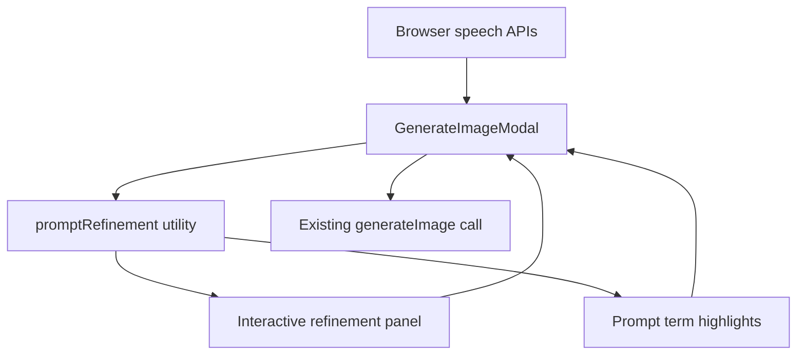

# Interactive Prompt Refinement - Plan

## Goal Capsule

| Field | Value |
|---|---|
| Objective | Add an interactive prompt-refinement mode to the KaiGen editor modal so users can expand rough image ideas into richer prompts before generation. |
| Authority | Root `AGENTS.md`, `src/AGENTS.md`, `tests/AGENTS.md`, existing modal behavior, then this plan. |
| Execution profile | Client-side WordPress editor UI change with no server endpoint change and no AI model identifier change. |
| Stop conditions | Stop if the work requires new provider APIs, server-side prompt rewriting, or changing generation model identifiers. |
| Tail ownership | Build artifacts in `build/` must be regenerated from `src/`; tests and linters named in the Verification Contract must pass or be reported with blockers. |

---

## Product Contract

### Summary

Interactive mode adds a guided layer inside `GenerateImageModal` that helps users describe what they see in their mind before they press Generate.
The first release uses deterministic prompt lenses and local browser speech APIs, keeping the existing generation endpoint and provider payload intact.
Users can turn the layer on, answer short creative prompts, enrich highlighted terms from their prompt, and keep full control of the final prompt text.

### Problem Frame

KaiGen currently accepts a single free-form prompt.
That is fast for experienced users, but many users under-specify subject, setting, mood, composition, color, and style.
The requested experience should make the modal feel like a creative collaborator without making generation slower or hiding the prompt that will be sent.

### Requirements

**Mode and flow**

- R1. The modal offers an `Interactive mode` control that can be enabled without changing the default quick-generate path.
- R2. When interactive mode is enabled, the modal shows a compact refinement panel with stage controls for idea, details, and direction.
- R3. The panel asks one short context question at a time and provides answer chips that append useful prompt details.
- R4. Users can ignore the panel and type or generate normally at any time.

**Prompt expansion**

- R5. The UI extracts meaningful prompt terms from the current prompt and renders them as highlighted selectable terms.
- R6. Selecting a highlighted term opens deterministic expansion choices for color, mood, material, scale, action, or visual specificity.
- R7. Choosing an expansion updates the visible prompt text directly so the generated image uses the refined wording.

**Voice assistance**

- R8. The modal exposes browser voice dictation when `SpeechRecognition` or `webkitSpeechRecognition` is available.
- R9. Voice dictation appends recognized text to the current prompt and reports listening or unsupported states without blocking typing.
- R10. The active refinement question can be read aloud with `speechSynthesis` when the browser supports it, and the UI remains usable when it does not.

**Compatibility and accessibility**

- R11. Existing reference image, provider, aspect ratio, generation, preview, and progress behavior remain unchanged.
- R12. The refinement UI is keyboard reachable and uses button labels that explain the action without relying on hover.
- R13. The modal remains responsive within the existing square frame on desktop and mobile widths.

### Key Flows

- F1. Quick generation unchanged
  - **Trigger:** User opens KaiGen and leaves interactive mode disabled.
  - **Steps:** User types a prompt, selects optional references or settings, and presses Generate.
  - **Outcome:** Existing `generateImage( prompt.trim(), options )` behavior runs.
  - **Covered by:** R1, R4, R11
- F2. Guided refinement
  - **Trigger:** User enables interactive mode after entering or before entering a prompt.
  - **Steps:** The panel shows the current stage, asks a question, and offers chips such as setting, lighting, or mood.
  - **Outcome:** Chip selections append comma-separated details to the prompt.
  - **Covered by:** R2, R3, R4, R7
- F3. Highlighted term expansion
  - **Trigger:** User types `a duck` and selects the highlighted `duck` term.
  - **Steps:** The expansion popover offers choices such as `yellow duck`, `tiny duck`, or `ceramic duck`.
  - **Outcome:** The selected wording replaces that prompt term.
  - **Covered by:** R5, R6, R7
- F4. Voice-assisted prompt capture
  - **Trigger:** User presses the microphone button in a browser with speech recognition.
  - **Steps:** The UI enters listening state, receives a transcript, and appends the transcript to the prompt.
  - **Outcome:** The prompt can be refined further or generated normally.
  - **Covered by:** R8, R9

### Scope Boundaries

- This plan does not add server-side prompt rewriting, new REST routes, or provider-specific prompt payload changes.
- This plan does not persist interactive conversations between modal sessions.
- This plan does not add full conversational AI, audio recording uploads, or external speech services.
- This plan does not change image or alt-text model identifiers.

---

## Planning Contract

### Key Technical Decisions

- KTD1. Keep refinement client-side and deterministic for the first release because the existing server path already generates images from a prompt and the request emphasizes simple intermediate steps.
- KTD2. Model the design process as prompt lenses, not sub-agent infrastructure, because static stages for idea, details, and direction deliver the requested guidance without new APIs.
- KTD3. Render highlighted prompt terms as a token row adjacent to the textarea instead of replacing the textarea with a custom editor because native textarea behavior is already stable in the modal.
- KTD4. Use browser speech APIs only as progressive enhancement because WordPress editor browsers vary and unsupported voice features must not block prompt entry.
- KTD5. Keep all generated prompt changes visible in the textarea because users need control over the final text sent to generation.

### High-Level Technical Design

`GenerateImageModal` remains the integration point.
A small utility module owns prompt token extraction, stage questions, chip text, expansion choices, and prompt update helpers.
The modal consumes those helpers to render the optional panel and to update the existing `prompt` state.
Generation continues to read `prompt.trim()` from the same state.

### Existing Patterns To Follow

- `src/components/GenerateImageModal.js` keeps modal state local with React hooks and WordPress component primitives.
- `assets/kaigen-admin.css` owns modal layout, menu, responsive, and button styling.
- `tests/unit/GenerateImageModal.test.js` currently verifies source and CSS contracts with file scans.
- `tests/e2e/image-generation.spec.ts` opens the real block editor modal and verifies visible controls.

### Assumptions

- The first useful product step is a guided prompt-refinement experience inside the existing modal, not a separate full-screen interface.
- Static prompt lenses are acceptable for MVP because they avoid introducing an AI text-generation dependency before the user has validated the interaction.
- Voice output is limited to reading the current question aloud, not conducting a full spoken conversation.

---

## Implementation Units

### U1. Prompt refinement utility

- **Goal:** Create deterministic prompt-refinement helpers for stages, questions, chips, token extraction, expansion choices, and prompt mutation.
- **Requirements:** R2, R3, R5, R6, R7
- **Files:** `src/utils/promptRefinement.js`, `tests/unit/promptRefinement.test.js`
- **Approach:** Add pure functions for extracting visible terms, selecting term expansion choices, replacing a selected term, appending stage chips, and returning stage metadata.
- **Patterns:** Follow the named-export style in `src/utils/kaigenSettings.js` and unit-test behavior directly.
- **Test scenarios:** Extract `duck` from `a duck in a pond`; ignore short filler words; replace only the selected term occurrence; append detail chips with readable punctuation; return safe fallback expansions for unknown terms.
- **Verification:** `npm run test:unit -- tests/unit/promptRefinement.test.js`

### U2. Interactive modal UI

- **Goal:** Integrate interactive mode, stage controls, question chips, highlighted terms, and voice controls into `GenerateImageModal`.
- **Requirements:** R1, R2, R3, R4, R5, R6, R7, R8, R9, R10, R11, R12
- **Files:** `src/components/GenerateImageModal.js`, `tests/unit/GenerateImageModal.test.js`
- **Approach:** Add local state for interactive mode, active stage, active term, listening state, and voice support; render the refinement panel only when enabled; wire chips and term choices to update the existing `prompt` state; keep `handleGenerate` unchanged except for reading the updated prompt.
- **Patterns:** Use existing `Button`, `Dropdown`, and `Dashicon` controls, and keep reference/provider/aspect menus unchanged.
- **Test scenarios:** Source includes an `Interactive mode` toggle; panel renders stage controls and term expansion dropdowns; generation still calls `generateImage( prompt.trim(), options )`; unsupported speech APIs produce disabled or labeled voice controls instead of errors.
- **Verification:** `npm run test:unit -- tests/unit/GenerateImageModal.test.js`

### U3. Modal styling and responsiveness

- **Goal:** Style the refinement layer so it fits the current modal on desktop and mobile without crowding the composer.
- **Requirements:** R2, R5, R6, R12, R13
- **Files:** `assets/kaigen-admin.css`, `tests/unit/GenerateImageModal.test.js`
- **Approach:** Add a compact panel above the prompt row, pill-style stage controls, token chips, expansion menu styling, and mobile wrapping rules.
- **Patterns:** Reuse the modal's existing white surfaces, `#3858e9` active state, 8px card radius maximum for repeated token elements, and current responsive breakpoint.
- **Test scenarios:** CSS includes refinement panel, stage, token, and expansion menu classes; mobile rules prevent the prompt row and refinement controls from overlapping.
- **Verification:** `npm run test:unit -- tests/unit/GenerateImageModal.test.js`

### U4. Editor behavior coverage and build artifacts

- **Goal:** Prove the feature works in the real editor and regenerate committed build output.
- **Requirements:** R1, R3, R5, R6, R7, R11, R13
- **Files:** `tests/e2e/image-generation.spec.ts`, `build/`
- **Approach:** Extend the modal E2E test to enable interactive mode, type a rough prompt, select a highlighted term expansion, and assert the textarea updates while existing controls remain visible; run the build after source changes.
- **Patterns:** Follow existing E2E helpers for opening the KaiGen modal and locating controls.
- **Test scenarios:** Interactive mode is initially off; enabling it reveals the guided panel; selecting an expansion updates `a duck` into a richer prompt; reference/provider/aspect controls remain visible.
- **Verification:** `npm run build`, `npm run test:unit`, `npm run test:e2e -- tests/e2e/image-generation.spec.ts`, `npm run lint:js`, `npm run lint:css`

---

## Verification Contract

| Gate | Command | Covers | Done signal |
|---|---|---|---|
| Unit tests for prompt helpers and modal contracts | `npm run test:unit` | U1, U2, U3 | Jest reports all unit tests passing. |
| Build committed assets | `npm run build` | U2, U3, U4 | `build/` updates from `src/` without build errors. |
| Browser editor behavior | `npm run test:e2e -- tests/e2e/image-generation.spec.ts` | U4 | Playwright verifies the modal in WordPress Playground. |
| JavaScript lint | `npm run lint:js` | U1, U2, U4 | Linter reports no JS violations. |
| CSS lint | `npm run lint:css` | U3 | Stylelint reports no CSS violations. |

---

## Definition of Done

- The default modal quick-generate path behaves as before when interactive mode is disabled.
- Interactive mode exposes guided stages, prompt detail chips, selectable highlighted terms, and deterministic expansion choices.
- Browser voice controls work as progressive enhancement and degrade without runtime errors when unsupported.
- The final generated prompt is always visible in and editable through the textarea.
- Existing reference image, provider, aspect ratio, generation progress, preview, and generated image insertion behavior remain intact.
- `src/` changes are reflected in committed `build/` output.
- Unit, build, E2E, JS lint, and CSS lint gates pass or any failure is reported with the concrete blocker.
- Dead-end experimental code and unused helper branches are removed before shipping.
